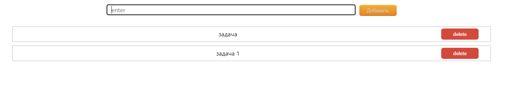

### Список задач

## Используемые технологии: React/Express/mongo.db

#### v. 1.1.3

# В разработке

## Реализовано:

1. Запись задачи в базу данных
2. Написание, удаление задачи
3. пометка выполненной задачи

   
